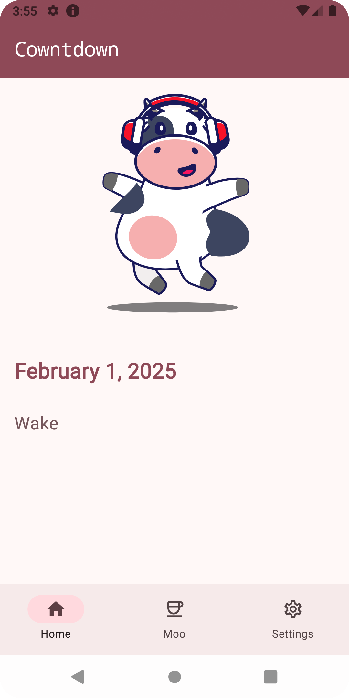
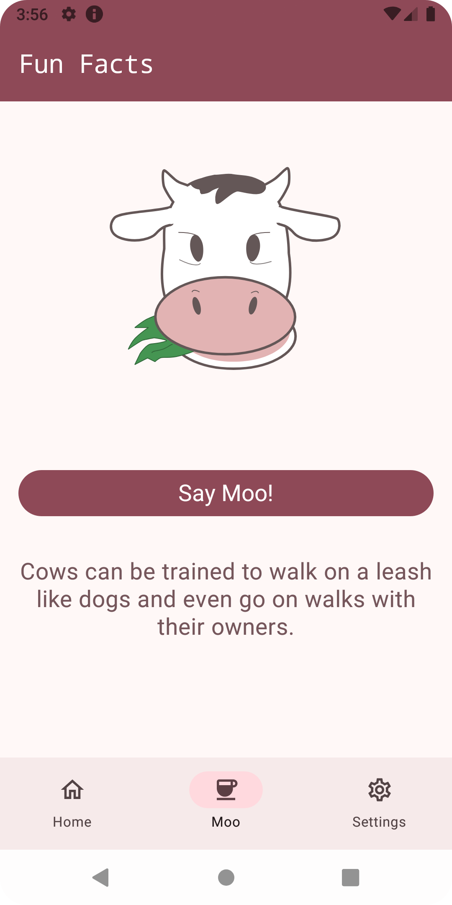
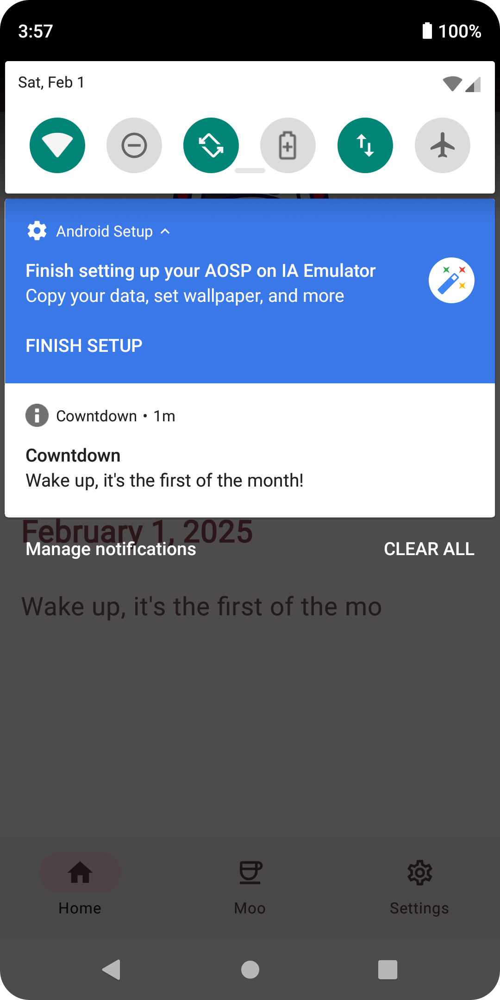
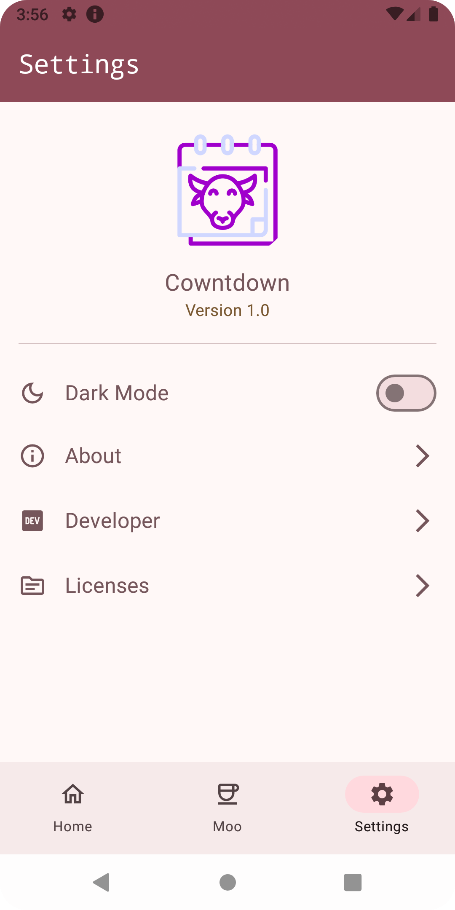
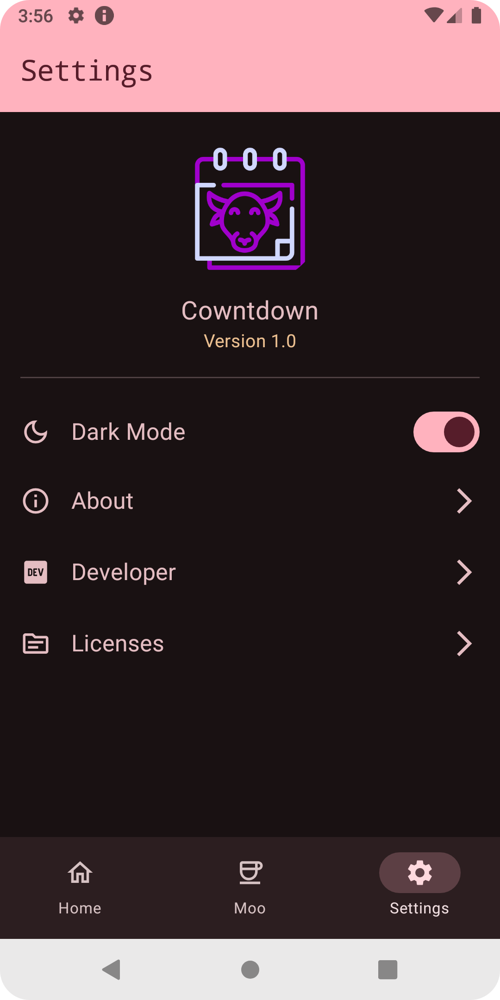
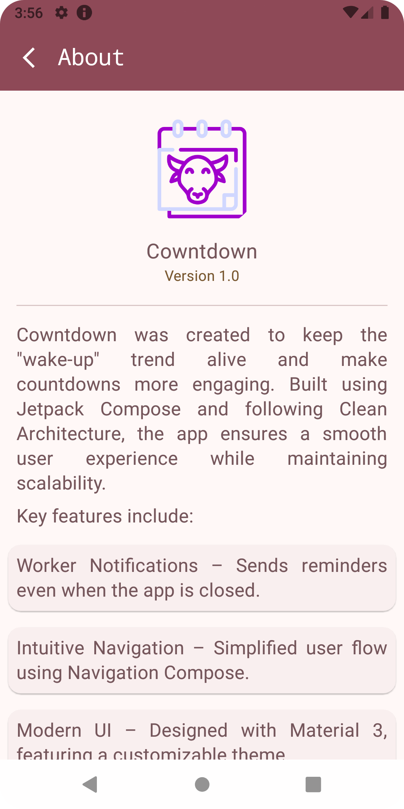
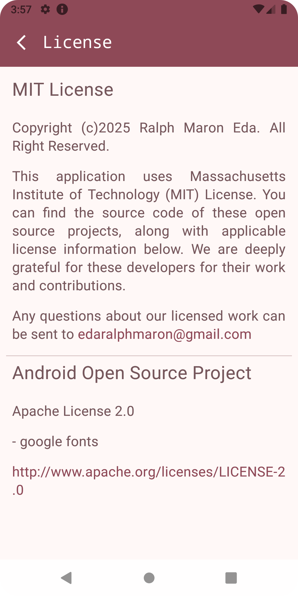

# 🐄 Cowntdown

**Moo-tastic Monthly Reminders! 🗓️🐮**  
Cowntdown is a fun and simple Android app that sends you a friendly notification on the first day of every month! Plus, enjoy dancing cows and fun cow facts along the way! 🎉

---

## ✨ Features

✅ **Monthly Notification** – Get a reminder on the 1st day of every month.  
✅ **Dancing Cows** – Watch adorable cows groove on your screen! 🕺🐮  
✅ **Fun Cow Facts** – Learn something new about cows every time! 📖💡  
✅ **Customizable Notifications** – Set the sound and time as you like. 🔔🎶

---

## 📸 Screenshots

  <figure>
    
    <figcaption>Home Screen - Dancing Cows</figcaption>
  </figure>
  <figure>
    
    <figcaption>Home Screen - Not first of month</figcaption>
  </figure>

  <figure>
    
    <figcaption>Moo Facts - Fun Cow Trivia</figcaption>
  </figure>
  <figure>
    
    <figcaption>Notification Alert</figcaption>
  </figure>

  <figure>
    
    <figcaption>Settings Screen - Light Theme (default)</figcaption>
  </figure>
  <figure>
    
    <figcaption>Settings Screen - Dark Theme</figcaption>
  </figure>

  <figure>
    
    <figcaption>About the app screen</figcaption>
  </figure>
  <figure>
    
    <figcaption>Developer screen</figcaption>
  </figure>

  <figure>
    
    <figcaption>License Screen</figcaption>
  </figure>

---

## 🚀 How to Install

1. Download the latest APK from the [Releases](https://github.com/ralphmarondev/Cowntdown/releases) page.
2. Install the APK on your Android device.
3. Open the app and let the **moo-gic** begin! 🐄✨

---

## 🛠️ Built With

- **Kotlin** & **Jetpack Compose** – For a modern UI experience.
- **WorkManager** – To handle background notifications.
- **Material 3** – For a sleek and polished design.

---

## 🤝 Contributing

Pull requests are welcome! If you find a bug or have a suggestion, feel free to open an issue.

---

## 📜 License

This project is licensed under the [MIT License](LICENSE.txt).

---

## 📢 Connect with Me

🐙 **GitHub**: [ralphmarondev](https://github.com/ralphmarondev)  
📸 **Instagram**: [@ralphmaron](https://www.instagram.com/ralphmaron/)  
🎵 **TikTok**: [@ralphmaron](https://www.tiktok.com/@ralphmaron)

🐄✨ _Stay moo-tivated!_
